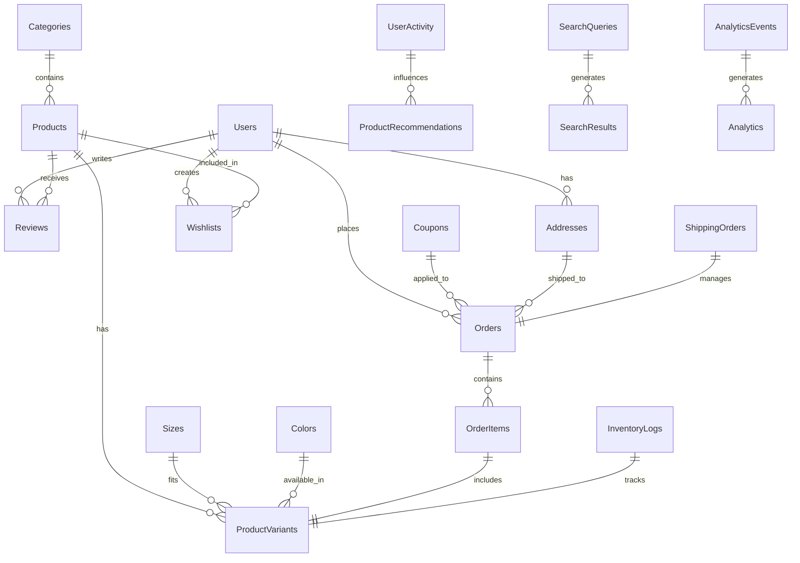

 # Women's Shoe Store - Professional E-commerce Architecture

## System Architecture Overview

````mermaid
graph TB
    subgraph "Frontend Layer"
        A[React Web App] --> B[Progressive Web App]
        A --> C[Mobile App<br/>React Native]
        A --> D[Admin Dashboard]
    end

    subgraph "API Gateway & Load Balancer"
        E[API Gateway] --> F[Rate Limiting]
        F --> G[Authentication]
        G --> H[Load Balancer]
    end

    subgraph "Microservices Layer"
        I[User Service]
        J[Product Service]
        K[Order Service]
        L[Payment Service]
        M[Inventory Service]
        N[Recommendation Service]
        O[Search Service]
        P[Notification Service]
        Q[Analytics Service]
    end

    subgraph "Data Layer"
        R[(MySQL Primary)]
        S[(MySQL Read Replicas)]
        T[(Redis Cache)]
        U[(Elasticsearch)]
        V[(MongoDB<br/>User Generated Content)]
    end

    subgraph "External Services"
        W[Stripe Payments]
        X[Email Service<br/>SendGrid]
        Y[SMS Service<br/>Twilio]
        Z[Shipping APIs<br/>FedEx/UPS/DHL]
        AA[CDN<br/>CloudFlare]
        BB[Analytics<br/>Google Analytics]
    end

    subgraph "Infrastructure"
        CC[Docker Containers]
        DD[Kubernetes Cluster]
        EE[Message Queue<br/>RabbitMQ]
        FF[Monitoring<br/>Prometheus/Grafana]
        GG[Logging<br/>ELK Stack]
    end

    A --> E
    C --> E
    D --> E
    E --> I

## Payment Processing Flow

```mermaid
sequenceDiagram
    participant C as Customer
    participant W as Web App
    participant O as Order Service
    participant P as Payment Service
    participant S as Stripe
    participant I as Inventory Service
    participant N as Notification Service

    C->>W: Initiates checkout
    W->>O: Create pending order
    O->>I: Reserve inventory
    I-->>O: Inventory reserved

    W->>P: Process payment
    P->>S: Create payment intent
    S-->>P: Payment confirmed

    alt Payment Success
        P->>O: Mark order as paid
        O->>I: Confirm inventory reservation
        O->>N: Send confirmation email
        N->>C: Order confirmation
    else Payment Failed
        P->>O: Mark order as failed
        O->>I: Release inventory
        N->>C: Payment failed notification
    end
````

## Search & Recommendation Architecture

```mermaid
graph LR
    A[Search Query] --> B[Elasticsearch]
    B --> C[Search Results]
    C --> D[Product Ranking]
    D --> E[Filtered Results]

    F[User Behavior] --> G[Analytics Service]
    G --> H[ML Model]
    H --> I[Recommendations]

    J[Product Catalog] --> B
    K[User History] --> H

    E --> L[Search Results UI]
    I --> M[Recommendation Widget]

    subgraph "Machine Learning Pipeline"
        N[Data Collection]
        O[Feature Engineering]
        P[Model Training]
        Q[Model Deployment]

        N --> O
        O --> P
        P --> Q
    end
```

## Microservices Communication

````mermaid
graph TD
    A[API Gateway] --> B[Message Bus]

    B --> C[User Service]
    B --> D[Product Service]
    B --> E[Order Service]
    B --> F[Payment Service]
    B --> G[Inventory Service]
    B --> H[Search Service]
    B --> I[Recommendation Service]
    B --> J[Notification Service]
    B --> K[Analytics Service]

## Security Architecture

```mermaid
graph TB
    subgraph "Security Layers"
        A[WAF<br/>Web Application Firewall] --> B[DDoS Protection]
        B --> C[Rate Limiting]
        C --> D[Authentication]
        D --> E[Authorization]
        E --> F[Data Encryption]
    end

    subgraph "Security Components"
        G[JWT Token Management]
        H[API Key Management]
        I[SSL/TLS Termination]
        J[Database Encryption]
        K[File Upload Security]
    end

    subgraph "Compliance"
        L[GDPR Compliance]
        M[PCI DSS]
        N[SOC 2]
        O[Data Privacy]
    end

    A --> G
    D --> H
    I --> J
    F --> K
    L --> M
    M --> N
    N --> O
````

## Performance Optimization Strategy

```mermaid
graph LR
    A[CDN] --> B[Static Assets]
    C[Browser Cache] --> D[Images & JS]
    E[Application Cache] --> F[Redis]
    G[Database Cache] --> H[Query Results]
    I[Search Cache] --> J[Elasticsearch]

    subgraph "Optimization Techniques"
        K[Image Optimization]
        L[Code Splitting]
        M[Lazy Loading]
        N[Database Indexing]
        O[Connection Pooling]
    end

    B --> K
    D --> L
    F --> M
    H --> N
    J --> O
```

## Technology Stack Summary

### Frontend Technologies

- **React 19** with TypeScript for type safety
- **Vite** for fast development and building
- **Bootstrap 5** with custom premium theme
- **React Router** for client-side routing
- **React Query/TanStack Query** for server state management
- **Zustand** for client state management
- **React Hook Form** for form handling
- **React Testing Library** for component testing

### Backend Technologies

- **Node.js** with Express.js framework
- **MySQL 8.0** with read replicas
- **Redis** for caching and session management
- **Elasticsearch** for advanced search
- **MongoDB** for user-generated content
- **JWT** for authentication
- **Stripe** for payment processing

### Infrastructure & DevOps

- **Docker** for containerization
- **Kubernetes** for orchestration
- **GitHub Actions** for CI/CD
- **Prometheus & Grafana** for monitoring
- **ELK Stack** for logging
- **CloudFlare** for CDN and security
- **AWS/Azure** for cloud hosting

### External Integrations

- **Stripe API** for payments
- **SendGrid** for email services
- **Twilio** for SMS notifications
- **Google Analytics** for tracking
- **FedEx/UPS/DHL APIs** for shipping
- **Facebook/Instagram APIs** for social commerce

## Implementation Priorities

### Phase 1 (Months 1-2): Foundation

1. Stripe payment integration
2. Enhanced order management
3. Basic inventory improvements
4. Performance optimizations

### Phase 2 (Months 3-4): Core Features

1. Advanced search with Elasticsearch
2. Basic recommendation engine
3. Enhanced admin dashboard
4. Customer analytics setup

### Phase 3 (Months 5-6): Advanced Features

1. AI-powered recommendations
2. Advanced marketing tools
3. Customer service improvements
4. Security enhancements

### Phase 4 (Months 7-8): Scale & Optimize

1. Microservices migration
2. Mobile application
3. Advanced logistics
4. Performance optimization

## Success Metrics

### Technical KPIs

- Page load time < 2 seconds
- 99.9% uptime
- Mobile performance score > 95
- Search response time < 500ms

### Business KPIs

- Conversion rate improvement
- Average order value increase
- Customer lifetime value growth
- Cart abandonment reduction

This architecture provides a comprehensive foundation for transforming the Women's Shoe Store into a professional, scalable, and feature-rich e-commerce platform. The microservices approach ensures maintainability and scalability, while comprehensive security and performance optimizations guarantee a robust production system.

    subgraph "Event Types"
        L[User Registered]
        M[Product Created]
        N[Order Placed]
        O[Payment Completed]
        P[Inventory Updated]
        Q[Search Query]
        R[Recommendation Request]
    end

    C -.->|User Registered| L
    D -.->|Product Created| M
    E -.->|Order Placed| N
    F -.->|Payment Completed| O
    G -.->|Inventory Updated| P
    H -.->|Search Query| Q
    I -.->|Recommendation Request| R

```

    E --> J
    E --> K
    E --> L
    E --> M
    E --> N
    E --> O
    E --> P
    E --> Q

    I --> R
    J --> R
    K --> R
    L --> R
    M --> R
    N --> U
    O --> U
    P --> V
    Q --> S

    I --> T
    J --> T
    K --> T
    L --> T

    L --> W
    P --> X
    P --> Y
    K --> Z
    A --> AA
    Q --> BB

    I -.-> EE
    J -.-> EE
    K -.-> EE
    L -.-> EE
    M -.-> EE

    I --> CC
    J --> CC
    K --> CC
    L --> CC
    M --> CC
    N --> CC
    O --> CC
    P --> CC
    Q --> CC

    CC --> DD
    DD --> FF
    DD --> GG

```

## Database Architecture


